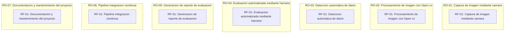

# Grafo de Dependencias -- Alarmadediario

_Generado automaticamente el 2026-09-04T13:56:11.991Z -- no editar a mano, se sobreescribe en cada publicacion._

```mermaid
graph TD
  subgraph US_OP_REQ_1787097664999["RO-01: Captura de imagen mediante camara"]
    REQ_1787097664999["RF-01: Captura de imagen mediante camara"]
  end
  subgraph US_OP_REQ_1787097872112["RO-02: Procesamiento de imagen con Open cv"]
    REQ_1787097872112["RF-01: Procesamiento de imagen con Open cv"]
  end
  subgraph US_OP_REQ_1787098109684["RO-03: Deteccion automatica de diario"]
    REQ_1787098109684["RF-01: Deteccion automatica de diario"]
  end
  subgraph US_OP_REQ_1787098282760["RO-04: Evaluacion automatizada mediante harness"]
    REQ_1787098282760["RF-01: Evaluacion automatizada mediante harness"]
  end
  subgraph US_OP_REQ_1787098876504["RO-05: Generacion de reporte de evaluacion"]
    REQ_1787098876504["RF-01: Generacion de reporte de evaluacion"]
  end
  subgraph US_OP_REQ_1787099043041["RO-06: Pipeline integracion ciontinua"]
    REQ_1787099043041["RF-01: Pipeline integracion ciontinua"]
  end
  subgraph US_OP_REQ_1787099177559["RO-07: Documentacion y mantenimiento del proyecto"]
    REQ_1787099177559["RF-01: Documentacion y mantenimiento del proyecto"]
  end
```