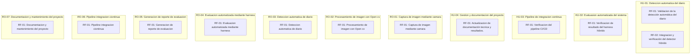

# Grafo de Dependencias -- Alarmadediario

_Generado automaticamente el 2026-10-26T00:03:26.830Z -- no editar a mano, se sobreescribe en cada publicacion._

```mermaid
graph TD
  subgraph US_1787079215619["HU-01: Deteccion automatica del diario"]
    REQ_1792604775046["RF-01: Validacion de la detección automática del diario"]
    REQ_1792605282525["RF-02: Integracion y verificación del detector hibrido"]
  end
  subgraph US_1787080130252["HU-02: Evaluasion automatizada del sistema"]
    REQ_1792605672087["RF-01: Verificacion de resultado del harness hibrido"]
  end
  subgraph US_1787084087129["HU-03: Pipeline de integracion continua"]
    REQ_1792606016657["RF-01: Verificacion del pipeline CI/CD"]
  end
  subgraph US_1787084947440["HU-04: Gestion y documentacion del proyecto"]
    REQ_1792606414695["RF-01: Actualizacion de documentación tecnica y resultados."]
  end
  subgraph US_OP_REQ_1787097664999["RO-01: Captura de imagen mediante camara"]
    REQ_1787097664999["RF-01: Captura de imagen mediante camara"]
  end
  subgraph US_OP_REQ_1787097872112["RO-02: Procesamiento de imagen con Open cv"]
    REQ_1787097872112["RF-01: Procesamiento de imagen con Open cv"]
  end
  subgraph US_OP_REQ_1787098109684["RO-03: Deteccion automatica de diario"]
    REQ_1787098109684["RF-01: Deteccion automatica de diario"]
  end
  subgraph US_OP_REQ_1787098282760["RO-04: Evaluacion automatizada mediante harness"]
    REQ_1787098282760["RF-01: Evaluacion automatizada mediante harness"]
  end
  subgraph US_OP_REQ_1787098876504["RO-05: Generacion de reporte de evaluacion"]
    REQ_1787098876504["RF-01: Generacion de reporte de evaluacion"]
  end
  subgraph US_OP_REQ_1787099043041["RO-06: Pipeline integracion ciontinua"]
    REQ_1787099043041["RF-01: Pipeline integracion ciontinua"]
  end
  subgraph US_OP_REQ_1787099177559["RO-07: Documentacion y mantenimiento del proyecto"]
    REQ_1787099177559["RF-01: Documentacion y mantenimiento del proyecto"]
  end
```